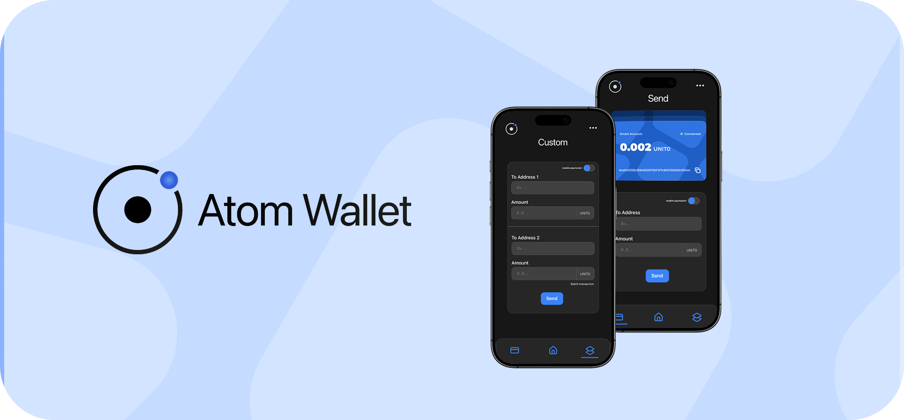

# Atom Wallet - ERC4337 Smart Wallet



Atom Wallet is a modern and user-friendly ERC4337 smart wallet application with AI-powered features. Enhanced with Account Abstraction technology, this wallet provides users with an advanced blockchain experience.

### ❗ For contracts, go to the contracts branch and review the documentation.

## 🌟 Features

### 🤖 AI-Powered Features

- LangChain and Google AI integration
- Smart transaction analysis and recommendations
- Natural language processing for wallet interactions
- Customized AI agents

### 💼 ERC4337 Integration

- Account Abstraction support
- Smart contract wallet capabilities
- Paymaster integration
- Batch transaction optimization

### 🔒 Security

- Multi-signature support
- Secure key management

## 🚀 Getting Started

### Requirements

- Node.js v18+
- Expo CLI
- Android Studio / Xcode (for native development)

### Installation

1. Clone the repository

```bash
git clone https://github.com/alperenbekci/atom-wallet
```

2. Install dependencies

```bash
npm install
```

3. Set up environment variables

```bash
cp .env.example .env
# Edit the .env file
```

4. Start the development server

```bash
npm start
```

## 📁 Project Structure

```
atom-wallet/
├── app/
│   ├── chat/
│   │   ├── index.tsx           # Ana sohbet arayüzü
│   │   └── components/         # Sohbet bileşenleri
│   ├── (tabs)/
│   │   ├── index.tsx          # Ana sayfa ve cüzdan özeti
│   │   ├── _layout.tsx        # Tab navigasyon yapılandırması
│   │   ├── history.tsx        # İşlem geçmişi
│   │   └── single.tsx         # Tekli işlem görünümü
│   ├── paymaster/
│   │   ├── index.tsx          # Gas yönetimi
│   │   └── components/        # Paymaster bileşenleri
│   ├── fund/
│   │   ├── index.tsx          # Fonlama işlemleri
│   │   └── components/        # Fonlama bileşenleri
│   ├── batch/
│   │   ├── index.tsx          # Toplu işlem yönetimi
│   │   └── components/        # Batch işlem bileşenleri
│   ├── +not-found.tsx         # 404 hata sayfası
│   └── _layout.tsx            # Ana uygulama düzeni
├── components/
│   ├── Core/
│   │   ├── WalletCard.tsx     # Ana cüzdan arayüzü (4.7KB)
│   │   ├── DualTransactionForm.tsx    # Çoklu işlem arayüzü (6.2KB)
│   │   ├── SingleTransactionForm.tsx  # Tekli işlem arayüzü (4.8KB)
│   │   ├── PaymasterInfo.tsx          # Paymaster durum gösterimi (4.4KB)
│   │   └── SendEthSection.tsx         # ETH transfer arayüzü (4.3KB)
│   ├── UI/
│   │   ├── TabButton.tsx      # Özel tab navigasyonu (1.0KB)
│   │   ├── HelloWave.tsx      # Karşılama animasyonu
│   │   ├── ParallaxScrollView.tsx  # Parallax kaydırma efekti
│   │   ├── ThemedText.tsx     # Temalı metin bileşeni
│   │   ├── ThemedView.tsx     # Temalı görünüm bileşeni
│   │   ├── Collapsible.tsx    # Katlanabilir panel
│   │   ├── ExternalLink.tsx   # Harici bağlantı bileşeni
│   │   └── HapticTab.tsx      # Dokunsal geri bildirim tab'ı
│   └── index.ts               # Bileşen exports
├── lib/
│   ├── agents/
│   │   ├── TransactionAgent.ts # Akıllı işlem yönetimi (4.3KB)
│   │   └── AIAgent.ts         # AI entegrasyonları
│   ├── services/
│   │   ├── blockchain/
│   │   │   ├── localWallet.ts # Yerel cüzdan yönetimi (7.1KB)
│   │   │   ├── transactions.ts # İşlem yönetimi (5.1KB)
│   │   │   ├── userOperation.ts # ERC4337 işlemleri (5.3KB)
│   │   │   ├── paymaster.ts   # Paymaster entegrasyonu (3.0KB)
│   │   │   ├── contracts.ts   # Kontrat etkileşimleri (3.1KB)
│   │   │   └── wallet.ts      # Cüzdan servisleri (2.5KB)
│   │   └── ai/
│   │       ├── langchain.ts   # LangChain entegrasyonu
│   │       └── googleAI.ts    # Google AI servisleri
│   ├── hooks/
│   │   ├── useWallet.ts       # Cüzdan hooks
│   │   ├── useTransactions.ts # İşlem hooks
│   │   └── useAI.ts          # AI hooks
│   ├── utils/
│   │   ├── crypto.ts         # Şifreleme yardımcıları
│   │   ├── format.ts         # Format dönüşümleri
│   │   └── validation.ts     # Doğrulama fonksiyonları
│   ├── types/
│   │   ├── wallet.ts         # Cüzdan tipleri
│   │   ├── transaction.ts    # İşlem tipleri
│   │   └── ai.ts            # AI tipleri
│   ├── abi/
│   │   ├── Wallet.json      # Cüzdan ABI
│   │   ├── Paymaster.json   # Paymaster ABI
│   │   └── Factory.json     # Factory ABI
│   ├── config/
│   │   ├── chains.ts        # Blockchain yapılandırması
│   │   └── ai.ts           # AI yapılandırması
│   ├── store.ts            # Zustand store yapılandırması
│   └── index.ts            # Lib exports
├── constants/
│   ├── theme.ts            # Tema sabitleri
│   ├── network.ts          # Ağ sabitleri
│   └── config.ts          # Uygulama sabitleri
├── assets/
│   ├── icons/
│   │   ├── wallet/        # Cüzdan ikonları
│   │   └── ui/            # UI ikonları
│   ├── images/
│   │   ├── banner.png     # Banner görseli
│   │   └── backgrounds/   # Arka plan görselleri
│   └── fonts/
│       ├── Inter/         # Inter font ailesi
│       └── Roboto/        # Roboto font ailesi
├── types/
│   ├── navigation.ts      # Navigasyon tipleri
│   └── env.d.ts          # Ortam değişkenleri tipleri
├── package.json          # Proje bağımlılıkları
├── tsconfig.json        # TypeScript yapılandırması
├── .env.example         # Örnek ortam değişkenleri
├── app.json            # Expo yapılandırması
└── config.ts           # Uygulama yapılandırması
```

### `/app` - Main Application Routes

- `/chat` - AI chat interface and natural language processing
  - `index.tsx` - Main chat interface
- `/(tabs)` - Main navigation and pages
  - `index.tsx` - Home page and wallet summary
  - `_layout.tsx` - Tab navigation configuration
  - `history.tsx` - Transaction history
  - `single.tsx` - Single transaction view
- `/paymaster` - Gas management and sponsored transactions
- `/fund` - Funding operations and balance management
- `/batch` - Batch transaction management and optimization
- `+not-found.tsx` - 404 error page
- `_layout.tsx` - Main application layout

### `/components` - UI Components

#### Core Components

- `WalletCard.tsx` (4.7KB)

  - Main wallet interface
  - Balance display
  - Quick actions
  - Transaction history preview

- `DualTransactionForm.tsx` (6.2KB)

  - Batch transaction interface
  - Multiple recipient handling
  - Gas optimization
  - Transaction preview

- `SingleTransactionForm.tsx` (4.8KB)

  - Single transaction interface
  - Address validation
  - Gas estimation
  - Token selection

- `PaymasterInfo.tsx` (4.4KB)

  - Paymaster status display
  - Gas sponsorship info
  - Network fee details
  - Paymaster selection

- `SendEthSection.tsx` (4.3KB)

  - ETH transfer interface
  - Gas fee calculation
  - Amount validation
  - Quick send options

- `TabButton.tsx` (1.0KB)
  - Custom tab navigation
  - Active state management
  - Haptic feedback
  - Visual indicators

#### UI Components

- `HelloWave.tsx` - Welcome animation
- `ParallaxScrollView.tsx` - Parallax scroll effect
- `ThemedText.tsx` - Themed text component
- `ThemedView.tsx` - Themed view component
- `Collapsible.tsx` - Collapsible panel
- `ExternalLink.tsx` - External link component
- `HapticTab.tsx` - Haptic feedback tab

### `/lib` - Core Libraries

#### Main Modules

- `/agents` - AI agents and transaction analysis
  - `TransactionAgent.ts` - Smart transaction management
- `/services` - Blockchain and API services
- `/hooks` - Custom React hooks
  - Blockchain state management
  - Wallet interactions
  - AI integrations
- `/utils` - Helper functions
  - Encryption
  - Format conversions
  - Validation
- `/types` - TypeScript type definitions
- `/abi` - Smart Contract ABIs
- `/config` - Configuration files
- `store.ts` - Zustand store configuration
- `index.ts` - Lib module exports

### `/constants` - Constants

- Theme constants

### `/assets` - Media Files

- Icons
- Images
- Font files

### `/types` - Global Type Definitions

- Contract Functions types

### Root Directory Files

- `package.json` - Project dependencies and scripts
- `tsconfig.json` - TypeScript configuration
- `.env.example` - Example environment variables
- `app.json` - Expo configuration
- `config.ts` - Application configuration

## 🛠 Technology Stack

### Frontend

- React Native + Expo
- TypeScript
- Expo Router
- React Native Reanimated

### Blockchain

- ethers.js v5.7.2
- ERC4337 integration
- Account Abstraction

### AI & Backend

- LangChain
- Google AI services
- Zustand state management

## 📦 Key Dependencies

```json
{
  "@langchain/core": "^0.3.40",
  "@langchain/google-genai": "^0.1.8",
  "ethers": "^5.7.2",
  "expo": "~52.0.36",
  "expo-router": "~4.0.17",
  "zustand": "^5.0.3"
}
```

## 🔧 Development

### Environment Variables

```env
GOOGLE_API_KEY=your_api_key
BUNDLER_URL=your_bundler_url
PAYMASTER_URL=your_paymaster_url
NETWORK_RPC_URL=your_rpc_url
CHAIN_ID=your_chain_id
ENTRYPOINT_ADDRESS=your_entrypoint_address
FACTORY_ADDRESS=your_factory_address
```

### Commands

```bash
npm start          # Start development server
npm run android    # Start for Android
npm run ios        # Start for iOS
npm test          # Run tests
npm run lint      # Run linting
```

## 📱 Supported Platforms

- iOS 13.0 and above
- Android 8.0 and above
- Web (Progressive Web App)

## 🌐 Network Support

### Networks

- Units Network

## 🔬 Technical Details

### Blockchain Services

#### Smart Wallet Structure

- `localWallet.ts` (7.1KB)
  - Local wallet management
  - Key generation and management
  - Transaction signing
  - Secure storage

#### Transaction Management

- `transactions.ts` (5.1KB)
  - Transaction creation and management
  - Gas optimization
  - Batch transaction support
  - Transaction history

#### UserOperation Management

- `userOperation.ts` (5.3KB)
  - ERC4337 UserOperation creation
  - Signature validation
  - Paymaster integration
  - Gas estimation

#### Paymaster Integration

- `paymaster.ts` (3.0KB)
  - Sponsored transaction support
  - Gas token management
  - Paymaster policies
  - Limit controls

#### Contract Interactions

- `contracts.ts` (3.1KB)
  - Smart contract calls
  - ABI management
  - Event listening
  - Contract state management

#### Wallet Services

- `wallet.ts` (2.5KB)
  - Wallet state
  - Balance management
  - Token management
  - Address validation

### AI Features

#### Transaction Analysis Agent

- `TransactionAgent.ts` (4.3KB)
  - Transaction security analysis
  - Automated transactions
  - Transaction explanations and recommendations

#### AI-Powered Features

- Natural language transaction creation

## 🤝 Contributing

1. Fork the repository
2. Create a feature branch (`git checkout -b feature/amazing-feature`)
3. Commit your changes (`git commit -m 'feat: Add amazing feature'`)
4. Push to the branch (`git push origin feature/amazing-feature`)
5. Open a Pull Request

## 📄 License

This project is distributed under a proprietary license.

## 🤝 Support

- Report issues via GitHub Issues
- Join our Discord community
- Visit our documentation

## 👥 Team

- Product Manager: [alperenbekci](https://github.com/alperenbekci)
- Product Manager: [murathankagan](https://github.com/murathanje)
